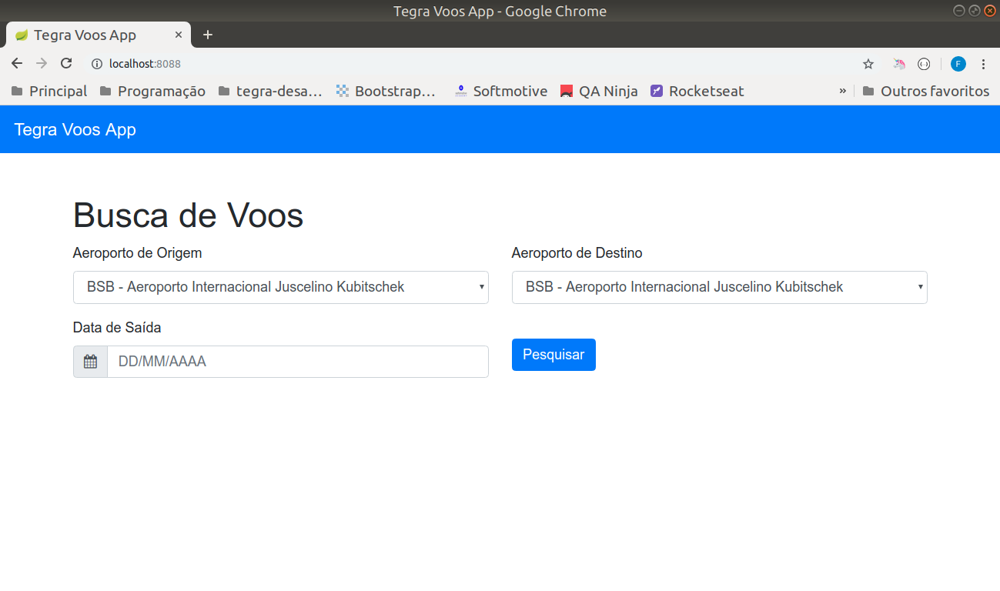
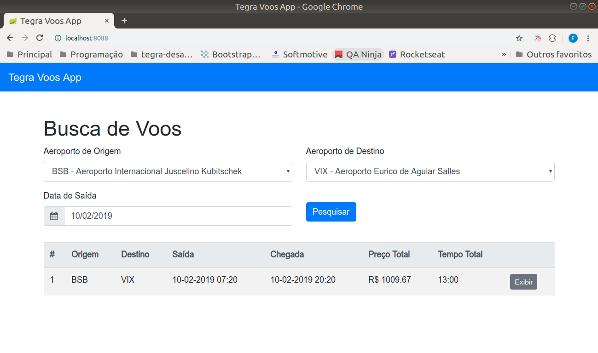
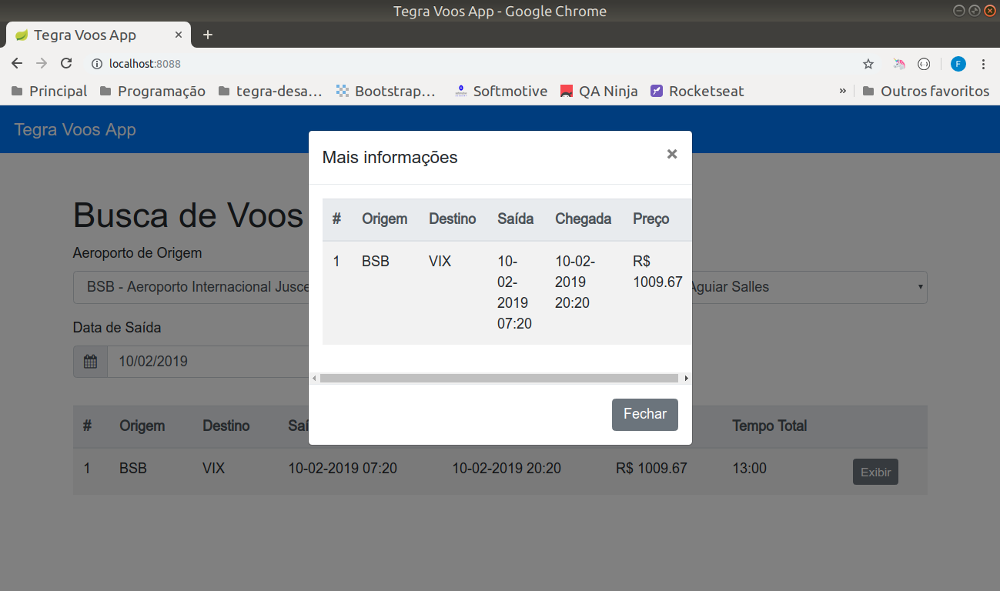
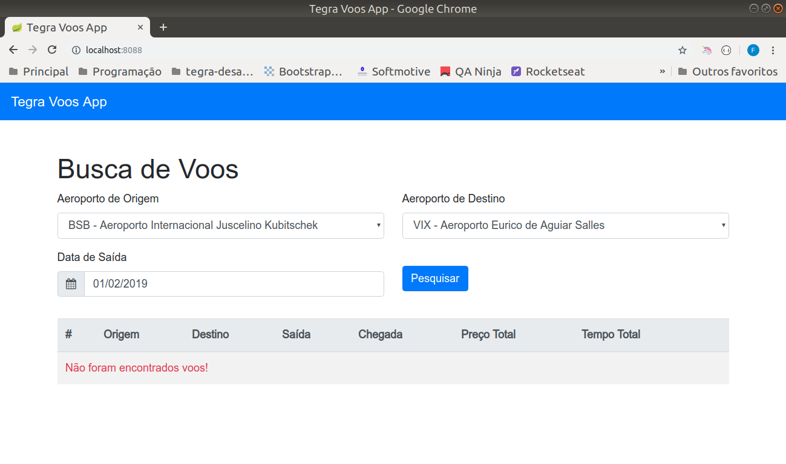

# Tegra Desafio Voos

Fernanda Aparecida Ferreira

30/03/2019

fromnanda.github.io

## Rodando a aplicação

Na raiz do repositório, existem 2 Dockerfiles, um para cada projeto. Siga os passos abaixo para a criação de cada container.

### 1. Criando network para as duas aplicações

```docker network create --subnet=172.18.0.0/16 tegra-voos```

### 2. Rodando aplicação back-end

```docker build -f Backend.Dockerfile -t tegra-voos-backend .```

```docker container run --network tegra-voos --name tegra-voos-backend --ip 172.18.0.22 -p 8080:8080 -d tegra-voos-backend```

### 3. Rodando aplicação front-end

```docker build -f Frontend.Dockerfile -t tegra-voos-frontend .```

```docker container run --network tegra-voos --name tegra-voos-frontend --ip 172.18.0.23 -p 8088:8088 -d tegra-voos-frontend --link=tegra-voos-backend --expose="8080"```

### 4. Para verificar os logs de cada aplicação

```docker container logs tegra-voos-backend```

```docker container logs tegra-voos-frontend```


## Swagger

A documentação da API do backend estará disponível na URL: ``http://localhost:8080/swagger-ui.html``

## Tecnologias
- Java 8
- SpringBoot
- Thymeleaf
- Bootstrap

# BackEnd - Endpoints

A aplicação backend estará disponível nos seguintes endpoints:

- GET http://localhost:8080/aeroportos
- POST http://localhost:8080/voos-disponiveis

    ```json
    {
        "origem": "VIX",
        "destino": "AJU",
        "data": "2019-02-10"
    }
    ```

## FrontEnd - Screenshots

A aplicação frontend estará disponível na URL: ``localhost:8088``







